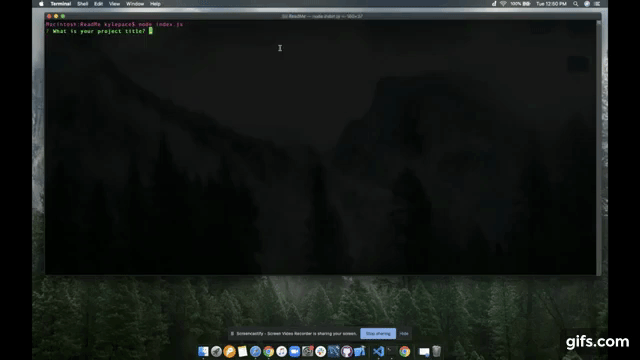
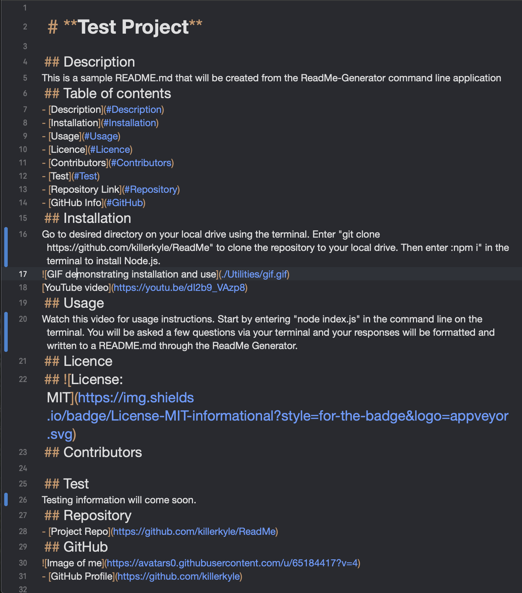

  # **Test Project**
  
  ## Description 
  This is a sample README.md that will be created from the ReadMe-Generator command line application
  ## Table of contents
  - [Description](#Description)
  - [Installation](#Installation)
  - [Usage](#Usage)
  - [Licence](#Licence)
  - [Contributors](#Contributors)
  - [Test](#Test)
  - [Repository Link](#Repository)
  - [GitHub Info](#GitHub) 
  ## Installation
  Go to desired directory on your local drive using the terminal. Enter "git clone https://github.com/killerkyle/ReadMe" to clone the repository to your local drive. Then enter :npm i" in the terminal to install Node.js.
    
  [YouTube video](https://youtu.be/dI2b9_VAzp8)
  ## Screenshot
  
  ## Usage
  Watch this video for usage instructions. Start by entering "node index.js" in the command line on the terminal. You will be asked a few questions via your terminal and your responses will be formatted and written to a README.md through the ReadMe Generator.
  ## Licence
  ## 
  ## Contributors
  Contact me for more information regarding the ReadMe generator or if you have anymore you would like to contribute to this project.
  ## Test
  Testing information will come soon.
  ## Repository
  - [Project Repo](https://github.com/killerkyle/ReadMe)
  ## GitHub
  
  - [GitHub Profile](https://github.com/killerkyle)
  
  
